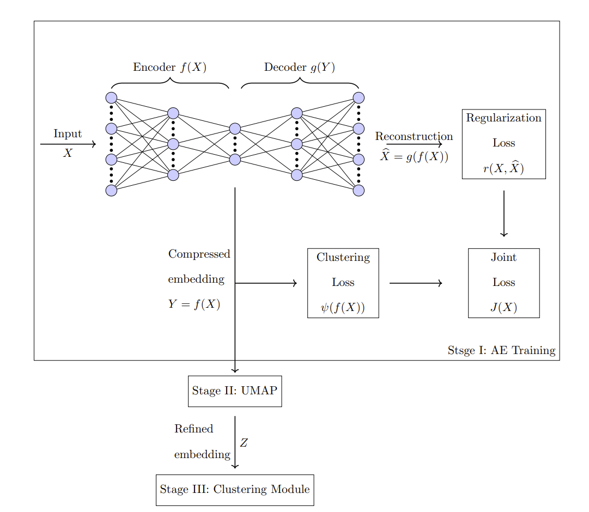
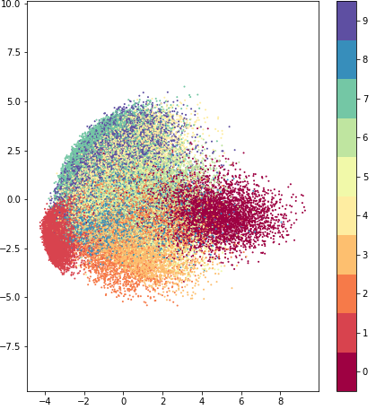
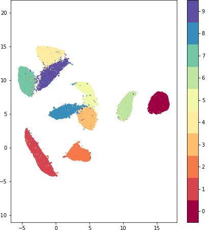
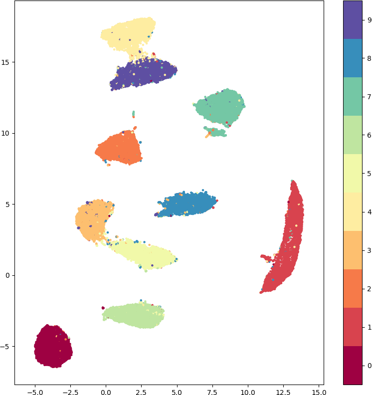
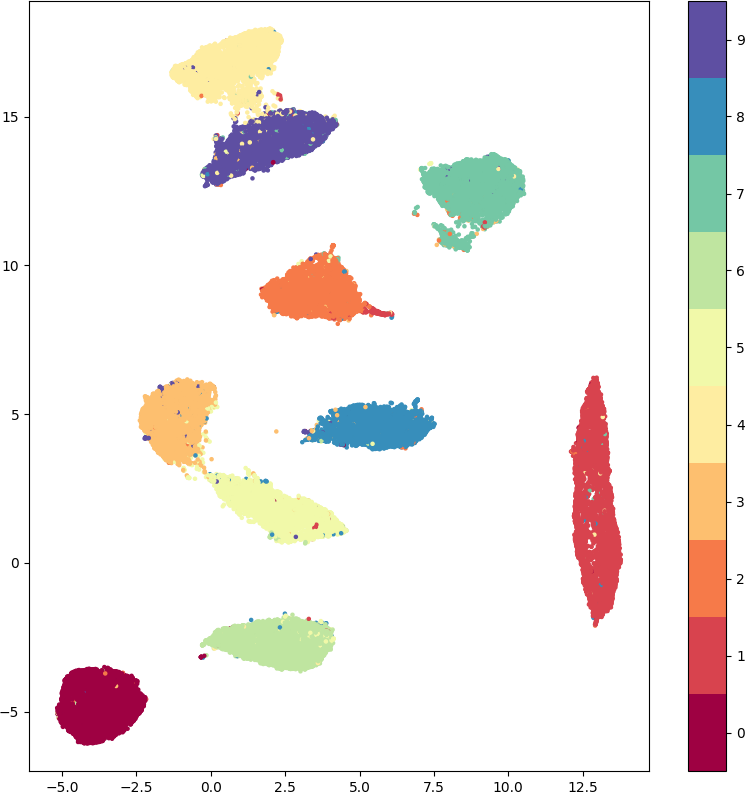
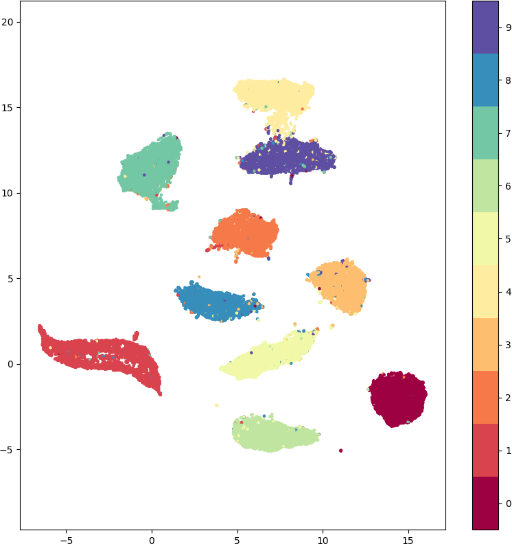
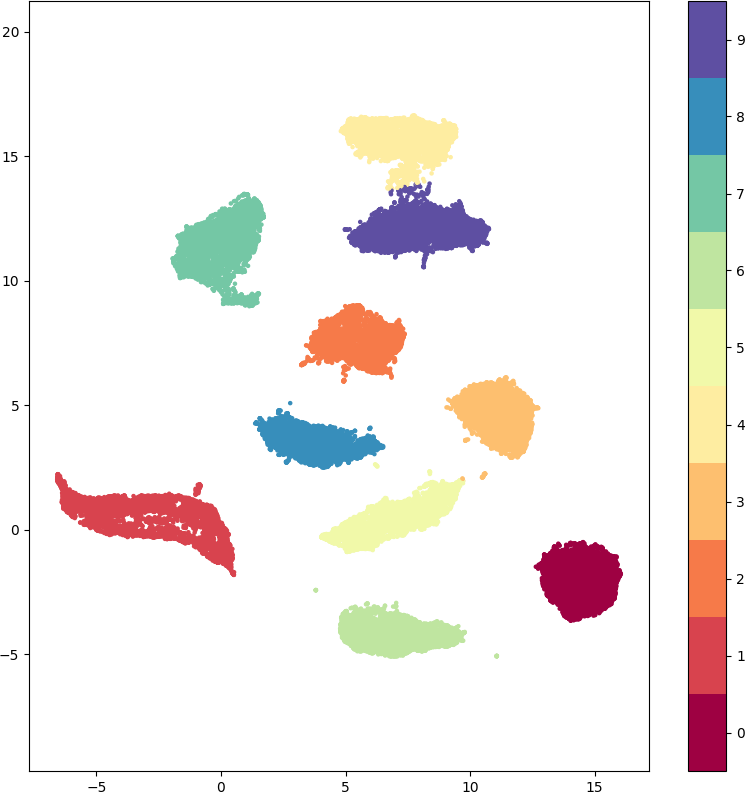
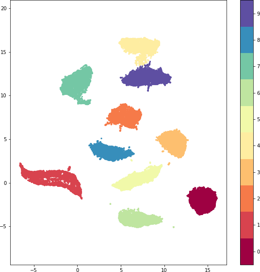

# Autoencoded UMAP-Enhanced Clustering (AUEC) Framework

## Overview

This repository contains the implementation of the AUEC framework for unsupervised learning. AUEC consists of three main stages:

1. **Autoencoder (AE) Stage**: 
   - The AE learns a compressed embedding of the data using a customized clustering-promoting loss function. The architecture of the AE can vary based on the input data type.

2. **UMAP Refinement Stage**:
   - UMAP is applied to refine the data embedding, reducing data dimensionality and enhancing clustering.

3. **Clustering Stage**:
   - A clustering algorithm (e.g., K-means or modified DBSCAN) is applied to the refined embedding for cluster identification.

## AUEC Framework for MNIST Dataset

In our AUEC framework applied to the MNIST dataset, we utilize Convolutional Neural Networks (CNNs) in the first stage. CNNs are well-suited for processing image data, making them an ideal choice for handling the MNIST dataset.

We use clusterability measures in the AUEC framework, including Within Cluster Sum of squares (WCSS), Worst Pair Ratio (WPR), and the Relative Spectral Gap (RSG) as the clustering loss components. Additionally, Mean Squared Error (MSE) is used as the regularization loss component.

For clustering, we apply K-means and Modified DBSCAN algorithms to the refined embeddings. The Modified DBSCAN algorithm enhances clustering accuracy by reassessing outlier points or those from smaller clusters and assigning them to the nearest primary cluster centroid, improving clustering accuracy over K-means.

## Application to MNIST Dataset

We applied the AUEC framework to the MNIST dataset, achieving an accuracy (ACC) surpassing 97.5% for the best results obtained using RSG as the loss function. The normalized mutual information (NMI) and adjusted Rand index (ARI) for these results are also provided.

## 2D Plot for Visualization with True Labels

<table>
    <tr>
        <td style="text-align:center;">2D-PCA-embedded MNIST data</td>
        <td style="text-align:center;">2D-UMAP-embedded MNIST data</td>
    </tr>
    <tr>
        <td style="text-align:center;"></td>
        <td style="text-align:center;"></td>
    </tr>
</table>

<table>
    <tr>
        <td style="text-align:center;">2D-AUEC-WCSS refined embedding of MNIST data</td>
        <td style="text-align:center;">2D-AUEC-WPR refined embedding of MNIST data</td>
        <td style="text-align:center;">2D-AUEC-RSG refined embedding of MNIST data</td>
    </tr>
    <tr>
        <td style="text-align:center;"></td>
        <td style="text-align:center;"></td>
        <td style="text-align:center;"></td>
    </tr>
</table>

## 2D-AUEC-RSG Plot for Visualization with Predicted Labels
<table>
    <tr>
        <td style="text-align:center;">2D-AUEC-RSG refined embedding of MNIST data with K-means labels</td>
        <td style="text-align:center;">2D-AUEC-RSG refined embedding of MNIST data with MDBSCAN labels</td>
    </tr>
    <tr>
        <td style="text-align:center;"></td>
        <td style="text-align:center;"></td>
    </tr>
</table>

### Performance Metrics for the Best Results

| Loss Function(RSG+MSE) | ACC  | NMI  | ARI  |
|----------------------|------|------|------|
| K-means              |97.50%|93.41%|94.58%|
| MDBSCAN              |97.52%|93.46%|94.64%|

In the table, we display the best results obtained using the RSG as the loss function. The results shown are for \( n_C = 8 \) with \( n_N = 6 \) components in UMAP. Please note that the optimal performance may vary for different configurations of UMAP components.

## Performance Benchmarking

According to the latest benchmarks on [paperswithcode](https://paperswithcode.com/sota/unsupervised-image-classification-on-mnist), AUEC ranks third in unsupervised clustering performance on the MNIST dataset.

